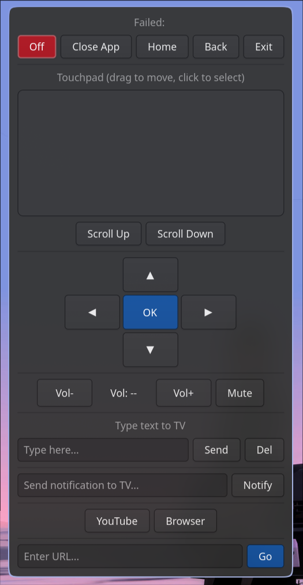

<div align="center">
  <h1>📺 Couch Commander</h1>

  
  
  
  <br/>
  <br/>

A GTK4 remote for LG webOS TVs. Touchpad, d-pad, volume, text input, app launcher, and more — all from your couch. Auto-discovers TVs on the network. Because standing up to find the remote is basically a workout.
<br/>


</div>

## What it does

Controls your LG TV from your Linux machine over the local network. Full remote replacement:

- **Touchpad** — move the cursor like a laptop trackpad
- **D-Pad & OK** — navigate menus the old-fashioned way
- **Volume** — up, down, mute (live updates)
- **Text input** — type into TV search fields from a real keyboard (finally)
- **App launcher** — YouTube, Browser, or anything installed
- **URL bar** — open links directly on the TV browser
- **Notifications** — send toast messages to the TV (passive-aggressive roommate mode)
- **Keyboard shortcuts** — arrow keys, space, escape, +/- all work
- **Power off** — the nuclear option

# Preview

<p align="center">
  
</p>

## Install

### Flatpak (recommended)

Download `couch-commander.flatpak` from the [latest release](https://github.com/wh1le/couch-commander/releases) and install:

```bash
flatpak install couch-commander.flatpak
flatpak run io.github.wh1le.CouchCommander
```

Or build from source:

```bash
git clone https://github.com/wh1le/couch-commander
cd couch-commander
make flatpak
flatpak run io.github.wh1le.CouchCommander
```

### NixOS / Nix

Everything is bundled — no system deps needed:

```bash
# run it
nix run github:wh1le/couch-commander

# dev shell
nix develop
```

### pip / pipx

> **Note:** GTK4 and PyGObject must be installed via your system package manager first. See [Dependencies](#dependencies).

```bash
# pipx (recommended)
pipx install git+https://github.com/wh1le/couch-commander

# or pip
pip install git+https://github.com/wh1le/couch-commander
```

### From source

```bash
git clone https://github.com/wh1le/couch-commander
cd couch-commander
make install
```

## Usage

```bash
couch-commander                # connect to default IP (192.168.50.160)
couch-commander --ip 10.0.0.5  # connect to a specific IP
couch-commander --scan         # auto-discover TVs and connect
couch-commander --list         # just list TVs on the network
```

If running from source:

```bash
./bin/couch-commander
# or
make start
```

On first launch, the TV will ask you to accept the connection. After that, the pairing key is saved to `~/.config/lgtv/keys.json`.

### Keyboard shortcuts

| Key        | Action     |
| ---------- | ---------- |
| Arrow keys | Navigate   |
| Enter      | Select     |
| Escape     | Back       |
| Space      | Play/Pause |
| +/-        | Volume     |
| M          | Mute       |
| H          | Home       |

## Testing

```bash
make test
```

## Configuration

Pass `--ip` to connect to a different TV, or use `--scan` to auto-discover:

```bash
./bin/couch-commander --ip 10.0.0.5
./bin/couch-commander --scan
```

The default IP (`192.168.50.160`) can be changed in `lib/config.py`.

## Dependencies

System packages (not installable via pip):

| Distro        | Install                                                   |
| ------------- | --------------------------------------------------------- |
| Arch          | `sudo pacman -S gtk4 python-gobject`                      |
| Fedora        | `sudo dnf install gtk4 python3-gobject`                   |
| Ubuntu/Debian | `sudo apt install libgtk-4-dev python3-gi gir1.2-gtk-4.0` |
| Nix           | `nix develop` (handled by flake)                          |

Python packages (installed automatically):

- `aiowebostv` — webOS TV communication

Other requirements:

- Python 3.12+
- An LG TV with webOS on the same network
- A strong commitment to never leaving the couch

## License

Do whatever you want with it. The couch is yours.
